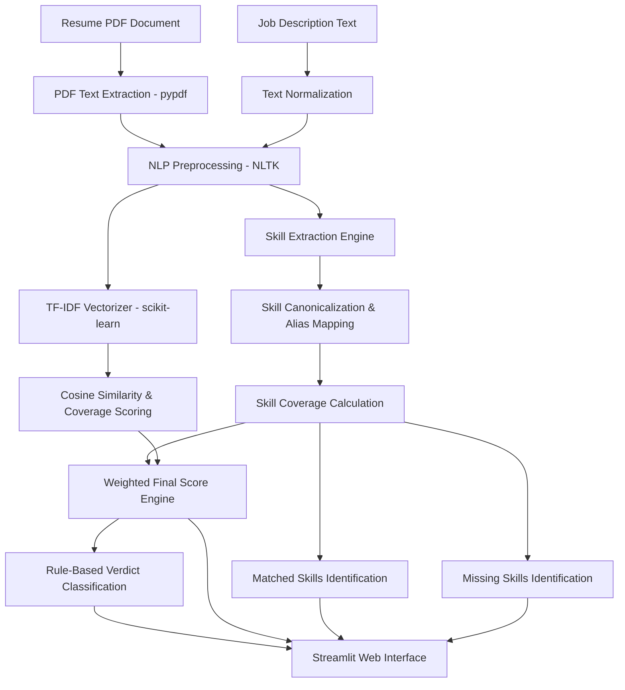

# SkillSync

> NLP-powered resume and job description matching platform that evaluates skill alignment using semantic text features and structured skill matching.

[](https://github.com/divysaxena24/SkillSync/actions/workflows/ci.yml)
[](https://github.com/divysaxena24/SkillSync/pkgs/container/skillsync)
[](https://www.python.org/)
[](https://streamlit.io/)
[](https://github.com/divysaxena24/SkillSync/tree/master/tests)

---

## Overview

SkillSync is an automated Resume–Job Description matching platform designed to evaluate candidate qualification against target job specifications. In modern recruitment workflows, manual resume evaluation is labor-intensive and subjective. SkillSync addresses this by performing structured natural language processing (NLP) to extract technical domain skills, normalize variant terminology, compute TF-IDF text coverage, and generate a weighted compatibility score.

### Workflow Summary

1. **Input**: Candidate resume uploaded as a PDF document alongside a target job description pasted as raw text.
2. **Text Processing**: Text extraction via `pypdf`, lowercasing, non-alphanumeric character filtering, tokenization, stopword removal, and WordNet lemmatization using `nltk`.
3. **Skill & Feature Extraction**: Regex pattern matching across standard skill taxonomies, canonical normalization of skill variants/aliases, and sublinear TF-IDF vectorization (`ngram_range=(1, 2)`).
4. **Scoring & Classification**: Calculation of a 70% skill coverage score combined with a 30% composite TF-IDF similarity score, mapped to a rule-based verdict tier.
5. **Output**: Interactive analytics dashboard displaying the overall compatibility score, match verdict, detailed metrics, matched skills, and missing candidate skills.

---

## Key Features

* **PDF Text Extraction**: Parses text content directly from uploaded PDF resume documents using `pypdf`.
* **NLP Preprocessing Pipeline**: Cleans, tokenizes, filters NLTK stopwords, and lemmatizes text with `WordNetLemmatizer`.
* **Dictionary-Based Skill Extraction**: Detects technical skills, frameworks, and domain-specific terminology across software engineering, data science, DevOps, finance, HR, healthcare, and design.
* **Canonical Skill Normalization**: Resolves aliases and framework variations (e.g., `React.js`/`ReactJS` to `react`, `PostgreSQL`/`MySQL`/`Postgres` to `sql`, `JS` to `javascript`, `TS` to `typescript`, `k8s` to `kubernetes`).
* **TF-IDF Text Similarity**: Computes sublinear TF-IDF vectors using unigrams and bigrams, combining 70% job description term coverage with 30% global cosine similarity.
* **Skill Coverage Analysis**: Quantifies exact candidate skill coverage against required job description skills and identifies matched versus missing requirements.
* **Weighted Compatibility Scoring**: Balances explicit technical skill overlap (70% weight) with overall document semantic similarity (30% weight).
* **Match Verdict Classification**: Categorizes final scores into four deterministic verdict levels (Strong Match, Moderate Match, Fair Match, Low Match).
* **Interactive Dashboard**: Streamlit interface with sample job profile presets, progress metrics, and dynamic skill tag visualization.
* **Automated Test Suite**: 57 pytest unit tests covering preprocessing, canonicalization, skill matching, similarity scoring, boundary conditions, and edge cases.
* **Containerization & CI/CD**: Multi-stage Docker containerization (Python 3.11-slim) with GitHub Actions CI testing and automated image publishing to GitHub Container Registry (GHCR).

---

## System Architecture

The diagram below illustrates the end-to-end data flow and processing pipeline implemented in SkillSync:



---

## NLP Pipeline & Scoring Methodology

### 1. Text Preprocessing

Raw text from resumes and job descriptions undergoes normalization before feature extraction:

1. Lowercasing text input.
2. Stripping non-alphabetic characters using regular expressions (`[^a-zA-Z\s]`).
3. Tokenizing text into words using `nltk.word_tokenize`.
4. Removing English stop words (`nltk.corpus.stopwords`).
5. Lemmatizing tokens to root forms using `nltk.stem.WordNetLemmatizer`.

### 2. Skill Extraction & Canonical Normalization

Skill detection uses word-boundary regex patterns (`(?<![a-z0-9])skill(?![a-z0-9])`) matching against predefined skill taxonomies while excluding generic non-skill terms (`software engineer`, `software development`, `problem solving`).

Detected terms are mapped to canonical identifiers via `SKILL_ALIASES`:

* `react.js`, `reactjs` -> `react`
* `postgres`, `postgresql`, `mysql`, `pl/sql` -> `sql`
* `js`, `jscript` -> `javascript`
* `ts` -> `typescript`
* `node`, `nodejs` -> `node.js`
* `express.js`, `expressjs` -> `express`
* `k8s` -> `kubernetes`
* `ml` -> `machine learning`
* `dl` -> `deep learning`

### 3. Skill Coverage Calculation

Skill match score measures the proportion of canonical job description skills present in the resume:

$$\text{Skill Score} = \begin{cases} \left( \frac{|\text{Matched Skills}|}{|\text{JD Skills}|} \right) \times 100, & \text{if } |\text{JD Skills}| > 0 \\ 0.0, & \text{otherwise} \end{cases}$$

Where:
* $\text{Matched Skills} = \text{Resume Skills} \cap \text{JD Skills}$
* $\text{Missing Skills} = \text{JD Skills} \setminus \text{Resume Skills}$

### 4. TF-IDF & Cosine Similarity

Text similarity is calculated using `sklearn.feature_extraction.text.TfidfVectorizer` configured with sublinear term frequency scaling (`sublinear_tf=True`) and unigram/bigram features (`ngram_range=(1, 2)`):

* **JD Coverage Score**: Weighted proportion of job description TF-IDF terms matched in the resume vector.
* **Cosine Similarity**: Cosine distance between job description and resume TF-IDF vectors:

$$\text{Cosine Similarity} = \frac{\mathbf{v}_{\text{jd}} \cdot \mathbf{v}_{\text{resume}}}{\|\mathbf{v}_{\text{jd}}\| \|\mathbf{v}_{\text{resume}}\|}$$

* **Composite TF-IDF Score**:

$$\text{TF-IDF Score} = 0.70 \times \text{Coverage Score} + 0.30 \times (\text{Cosine Similarity} \times 100)$$

### 5. Final Score & Verdict Tiers

The overall compatibility score prioritizes explicit skill overlap while incorporating overall semantic text similarity:

$$\text{Final Score} = 0.70 \times \text{Skill Score} + 0.30 \times \text{TF-IDF Score}$$

The final score maps directly to deterministic match verdict tiers:

| Score Range | Verdict Classification |
| :--- | :--- |
| $\ge 75.0\%$ | **Strong Match** |
| $50.0\% \le \text{Score} < 75.0\%$ | **Moderate Match** |
| $25.0\% \le \text{Score} < 50.0\%$ | **Fair Match** |
| $< 25.0\%$ | **Low Match** |

---

## Repository Structure

```text
SkillSync/
├── .github/
│   └── workflows/
│       └── ci.yml          # GitHub Actions CI/CD workflow
├── tests/
│   ├── __init__.py         # Test package initialization
│   └── test_nlp.py         # Automated pytest suite (57 tests)
├── app.py                  # Streamlit web application interface
├── nlp.py                  # Core NLP engine and scoring algorithms
├── test_nlp.py             # Dataset evaluation script
├── Dockerfile              # Docker container definition (Python 3.11-slim)
├── .dockerignore           # Docker build exclusion rules
├── .gitignore              # Git repository exclusion rules
├── requirements.txt        # Python dependency specifications
└── README.md               # Project documentation
```

---

## Tech Stack & Dependencies

* **Language**: Python 3.11
* **Natural Language Processing**: NLTK 3.9 (`punkt`, `stopwords`, `wordnet`), PyPDF 5.1
* **Machine Learning & Vectorization**: scikit-learn 1.6, NumPy, pandas, Gensim
* **Web Framework**: Streamlit 1.41
* **Testing**: pytest 9.0
* **Containerization & CI/CD**: Docker, GitHub Actions, GitHub Container Registry (GHCR)

---

## Local Setup & Installation

### Prerequisites

* Python 3.11 or higher
* Git

### Step-by-Step Installation

1. Clone the repository:

   ```bash
   git clone https://github.com/divysaxena24/SkillSync.git
   cd SkillSync
   ```

2. Create and activate a virtual environment:

   ```bash
   # Windows
   python -m venv venv
   .\venv\Scripts\activate

   # Linux / macOS
   python3 -m venv venv
   source venv/bin/activate
   ```

3. Install project dependencies:

   ```bash
   pip install --upgrade pip
   pip install -r requirements.txt
   ```

4. Launch the Streamlit application:

   ```bash
   streamlit run app.py
   ```

5. Access the web interface in your browser at `http://localhost:8501`.

---

## Running Automated Tests

SkillSync uses `pytest` for automated unit testing. The test suite validates preprocessing logic, PDF extraction, canonical alias mapping, skill extraction, TF-IDF scoring, score weighting formulas, and verdict boundary conditions.

Run all unit tests locally:

```bash
python -m pytest
```

Example test execution summary:

```text
============================= test session starts =============================
platform win32 -- Python 3.12.1, pytest-9.0.2, pluggy-1.6.0
rootdir: D:\DIVY\CODING\PURECODING\AI-ML\Projects\SkillSync
collected 57 items

tests\test_nlp.py ...................................................... [100%]

============================= 57 passed in 8.93s ==============================
```

---

## Docker Support & GHCR

### Building and Running Locally

To build and run SkillSync as a containerized service:

1. Build the Docker image:

   ```bash
   docker build -t skillsync:latest .
   ```

2. Run the Docker container:

   ```bash
   docker run -d -p 8501:8501 --name skillsync-app skillsync:latest
   ```

3. Open `http://localhost:8501` to use the application.

### Pulling from GitHub Container Registry (GHCR)

A pre-built Docker image is automatically compiled and published via GitHub Actions to GHCR on each push to `master`:

```bash
# Pull the latest image from GHCR
docker pull ghcr.io/divysaxena24/skillsync:latest

# Run the container
docker run -d -p 8501:8501 ghcr.io/divysaxena24/skillsync:latest
```

---

## Continuous Integration & Deployment

SkillSync includes a GitHub Actions workflow (`.github/workflows/ci.yml`) that executes on every push or pull request to `main`/`master`:

1. **Environment Setup**: Provisions Python 3.11 with `pip` dependency caching on `ubuntu-latest`.
2. **Dependency Installation**: Installs dependencies listed in `requirements.txt`.
3. **Automated Testing**: Executes `python -m pytest` across all unit tests.
4. **GHCR Authentication & Publishing**: Authenticates with GHCR (`ghcr.io`), builds the multi-stage Docker image, and publishes `ghcr.io/divysaxena24/skillsync:latest`.
5. **Live Deployment**: The production web application is hosted on Streamlit Community Cloud.

---

## License & Maintainer

Maintained by **Divy Saxena**.

* GitHub: [divysaxena24](https://github.com/divysaxena24)
* Repository: [SkillSync](https://github.com/divysaxena24/SkillSync)
